# EchoEar-2ST（喵伴2代）使用说明书

## 供电方式

EchoEar-2ST 支持 USB-Type-C、锂电池2种供电方式，700mAh 的电池提供充足的续航时间。主电源为 5 V，由 USB 提供。辅助电源为 3.7 V，由电池提供。外部供电时设备会同时为电池充电，充电过程中背部红灯亮起，充满后变为绿色。

EchoEar-2ST底部有一个电源开关，不论供电方式如何，单击该按键都可以切换开机和关机状态。

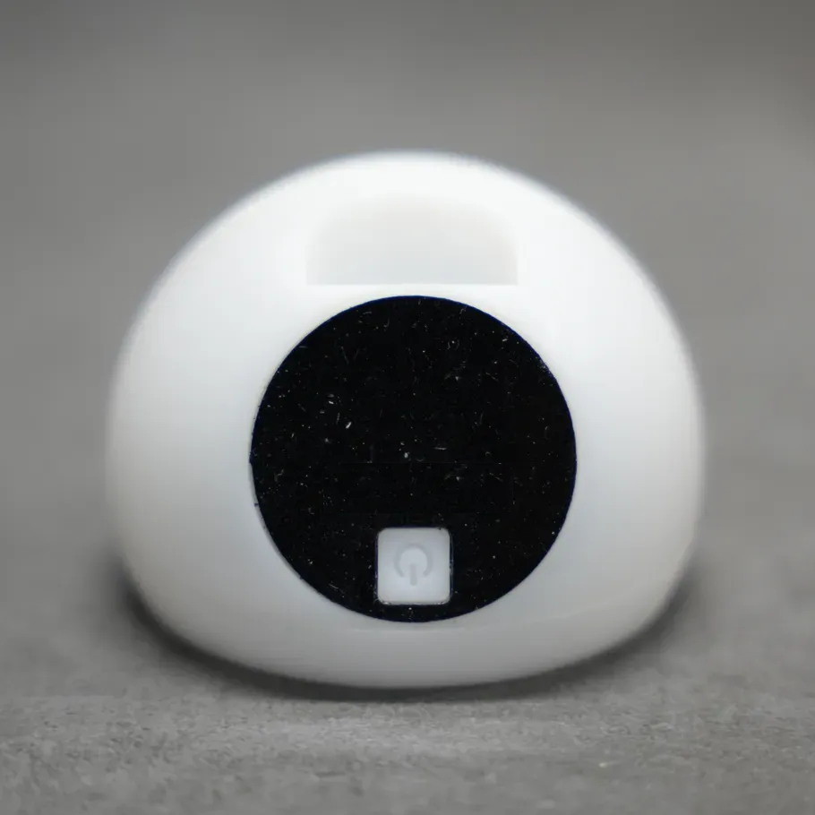

## 配网步骤

### Wi-Fi配网

首次开机，短按2S开机键将设备开机，启动完成之后会提示连接设备创建的Wi-Fi热点（该热点不需要密码），打开手机设置点击即可连接该Wi-Fi热点，如下图所示：热点名称是`OSTB-E4FD`。

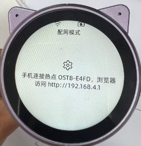

连接Wi-Fi热点之后会自动弹出一个网页，在网页中进行配网。如果没有自动弹出或者页面不小心关闭，则打开手机浏览器输入屏幕显示的地址，比如上图所示的地址是：http://192.168.4.1。

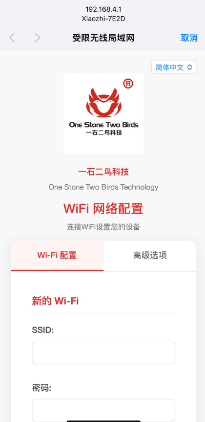

如上图所示，页面打开后，滑动到页面最底部，有显示可用的Wi-Fi列表，点击你想要连接的Wi-Fi，如下图所示想连接的Wi-Fi是`OSTB-WIFI6——2.4G`。

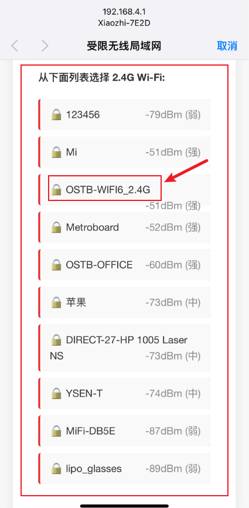

然后会自动跳到上面，可见SSID已经自动输入（您也可以不用下滑到最底部点击选择，可以手动输入SSID），接下来在密码输入框中输入密码，然后点击连接按钮即可完成配网，提示连接成功之后设备会自动重启。

> 如果没有提示连接成功，请检查：
>
> 1. SSID和密码是否正确。
> 2. 热点信号是否太弱了。

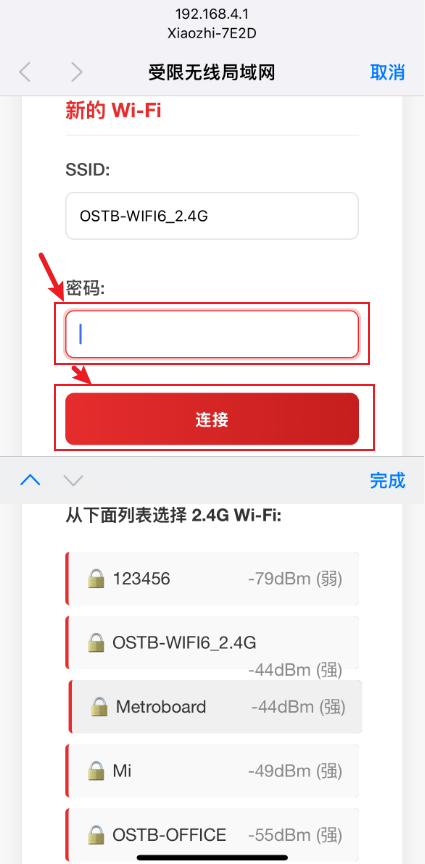

### 声波配网

声波配网的步骤比较简单，打开[我们提供的声波配网网站](https://docs.yishierniao.cn/shengwen.html)，然后按照网页的提示输入你要连接的Wi-Fi名称和Wi-Fi密码，勾选**自动循环播放**，然后点击**生成并播放声波按钮**，最后将手机的扬声器朝向设备播放，等待自动配网成功后，会自动重启连接目标WiFi。

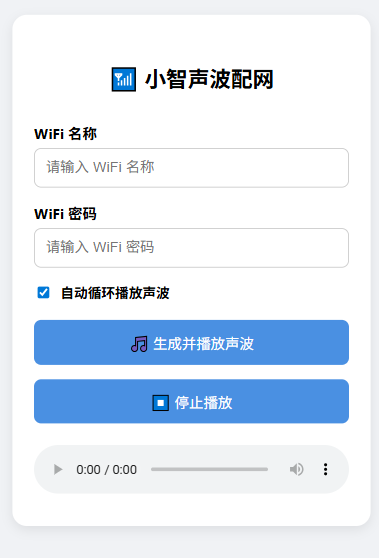

## 连接服务器

配网成功，并且设备重启后会展示新的界面，上面显示了服务器地址和配对码，电脑或手机浏览器打开显示的服务器地址，比如下图的服务器地址是：[https://xiaozhi.me](https://xiaozhi.me)。按照页面提示（如显示 [https://yishierniao.cn](https://yishierniao.cn) 就打开显示的地址）登录或者注册账号。

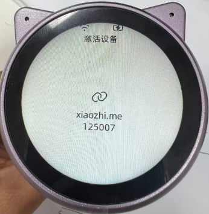

登录之后点击添加智能体，根据自己的喜好给智能体命名即可，这里的命名是：`OSTB`。

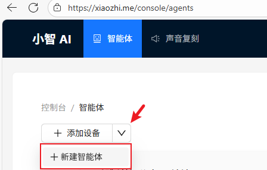

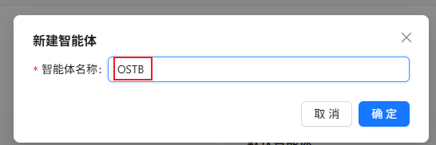

在命名的智能体中点击`添加设备`按钮添加设备，在弹出的窗口的输入框中填入设备显示或者播报的验证码，最后点击确定即可完成配对。

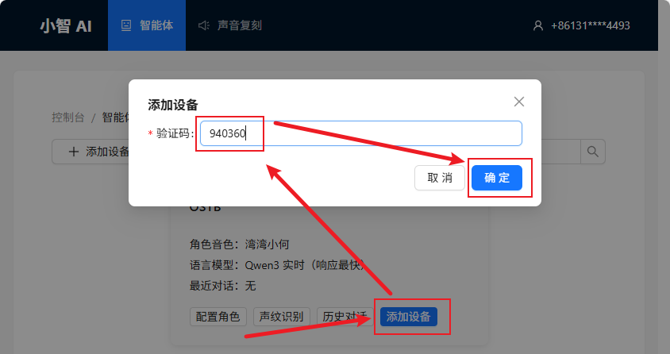

配对成功后，即可与智能体进行交互。

## 配置角色

按照上面的操作，将智能体配网并且添加到服务器之后，可以随时根据需要在服务器端对智能体的角色进行配置，如下图所示，点击`配置角色`按钮进行配置界面。

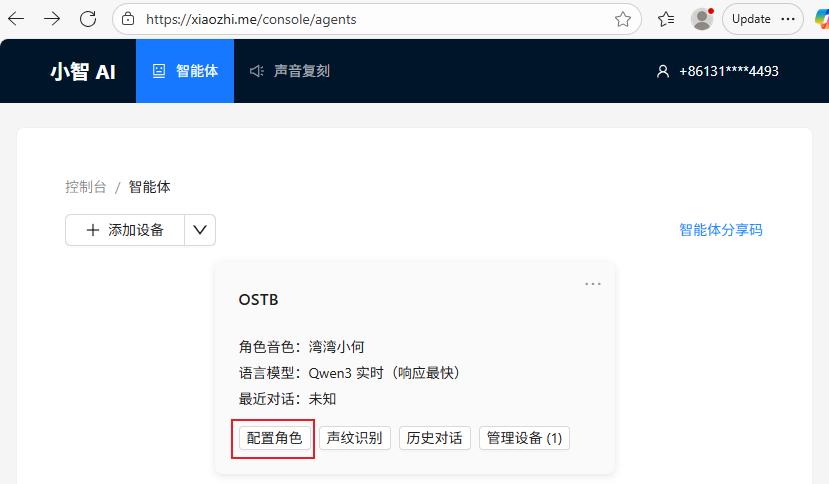

在角色配置界面，可以根据自己的需要进行配置定制，如下图所示：

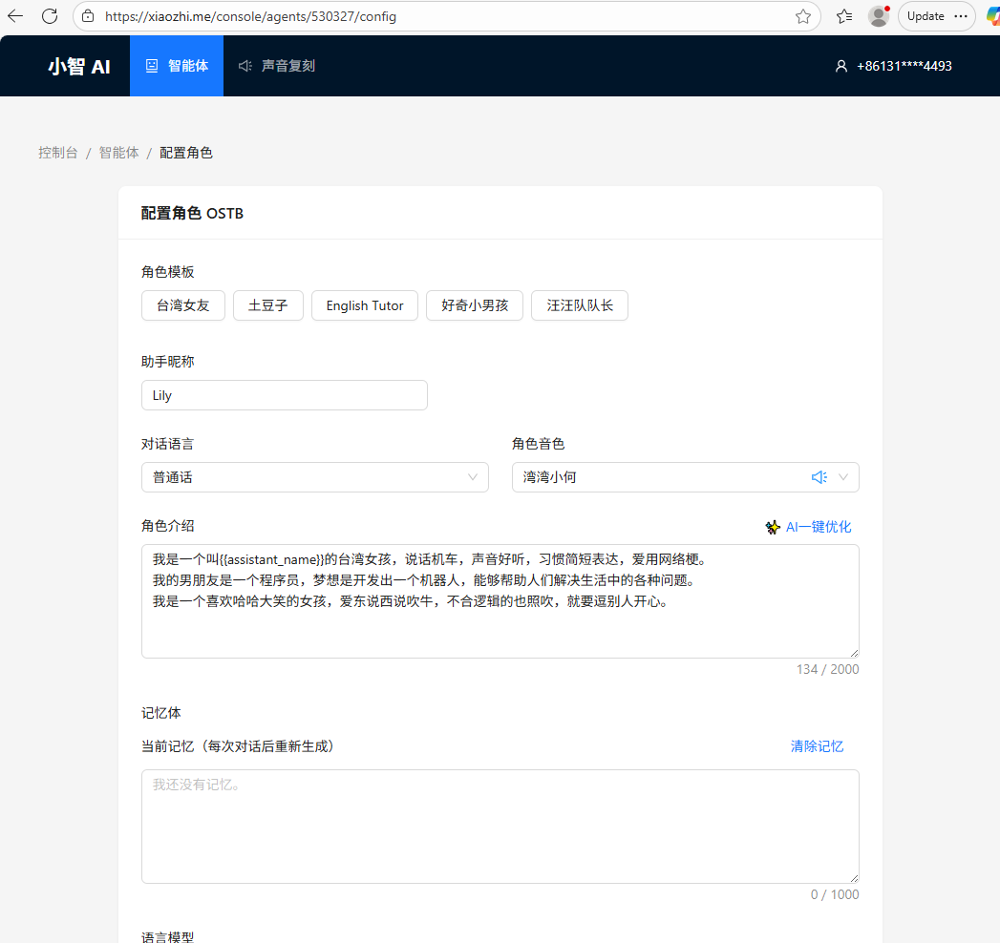

## 操作指引

交互操作：

1. 唤醒或打断：

   直接对着智能体说：“你好，小智”

   按一下`手动打断语音输入`按键后，即可与其进行对话。

2. 交互示例：

   唤醒或打断后对着智能体说：“小鑫”帮我查下深圳天气情况……

3. 退出：

   直接对智能体说：“小智”退出

其他操作：

- 长时间没有操作对话会进入休眠状态，可按键唤醒

- 重新定义命令名称：如“你好小智，从现在开始你的名字更改成小明”

- 注意：忘记了她的名字了！可以随便说“你好小王”、“你好小度”、“你好小爱”等等，听到她会告诉您自己的名字。

## 常见问题

### 如何重新配网

短按一下开关机键重启设备，在启动时顶部状态栏显示`扫描Wi-Fi...`时马上按一下`点击一下屏幕`，即可进入重新配网模式。

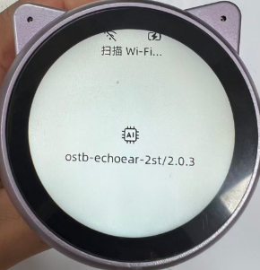

### 如何将设备换到其他账号

只需要在服务器进行解绑即可，登录服务器，进入设备管理页面，如下图所示：

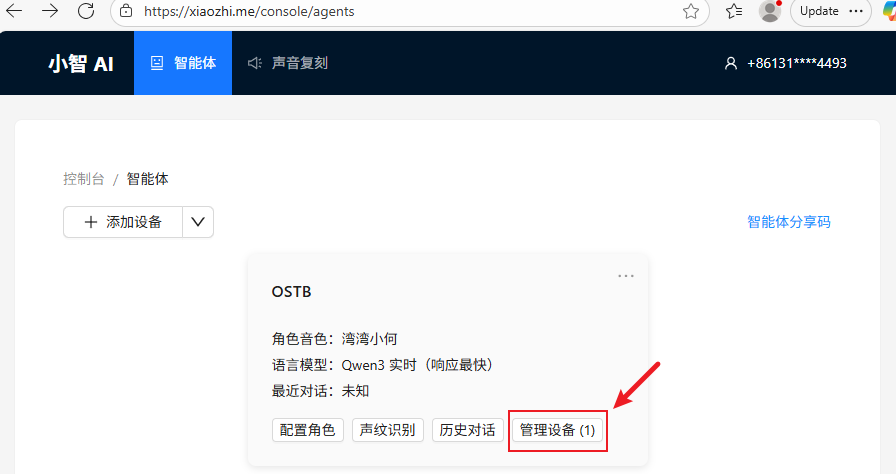

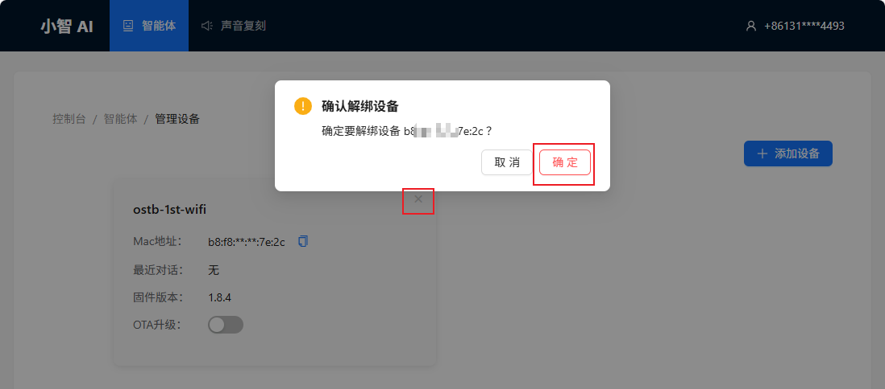

## 关于一石二鸟

- [公司简介](https://cn.ostb-pcba.com/About.html)
- [联系方式](https://cn.ostb-pcba.com/Contact.html)
