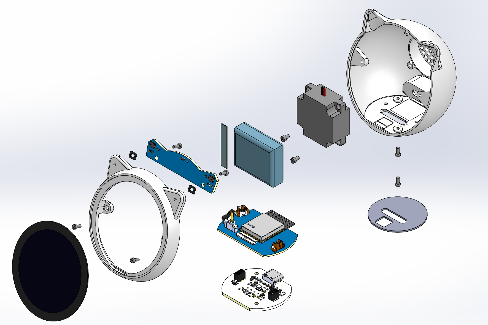

# EchoEar（喵伴）产品资料

## 产品介绍
[EchoEar（喵伴）](https://detail.1688.com/offer/963702261930.html)适用于玩具、智能音箱、智能中控等需要大模型赋能的语音交互类产品。该设备搭载 ESP32-S3-WROOM-1 模组，1.85 寸 QSPI 圆形触摸屏，双麦阵列，支持离线语音唤醒与声源定位算法。喵伴可实现全双工语音交互、多模态识别与智能体控制。

### 功能亮点
1. 搭载 ESP32-S3 双核 Wi-Fi & BLE 模组
2. 配备 1.85 英寸 360×360 QSPI 圆形触摸屏
3. 集成 2 Mic 阵列，3W 扬声器
4. 磁吸式 Pogopin 接口，支持拓展电机旋转底座
5. 支持离线语音唤醒 + 声源定位算法（基于ESP32-S3 算法）
6. 由火山引擎提供豆包大模型服务，支持智能对讲 + 情绪识别 + 长记忆库能力
7. 支持运行小智AI固件

EchoEar 本体 3D 结构爆炸图

## 产品购买、商务链接

- [https://detail.1688.com/offer/963702261930.html](https://detail.1688.com/offer/963702261930.html)

## 关于一石二鸟

- [公司简介](https://cn.ostb-pcba.com/About.html)
- [联系方式](https://cn.ostb-pcba.com/Contact.html)
