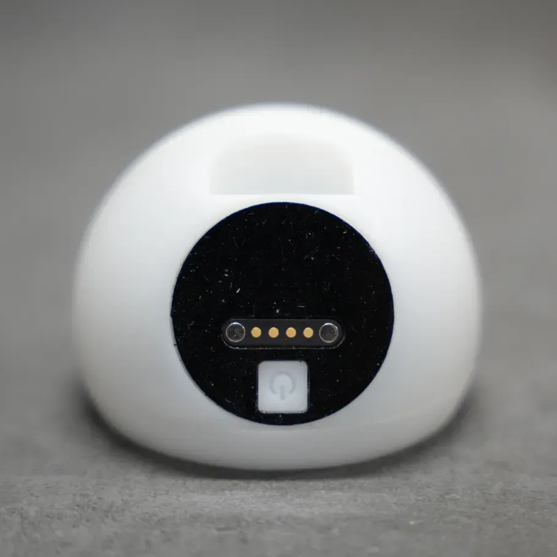
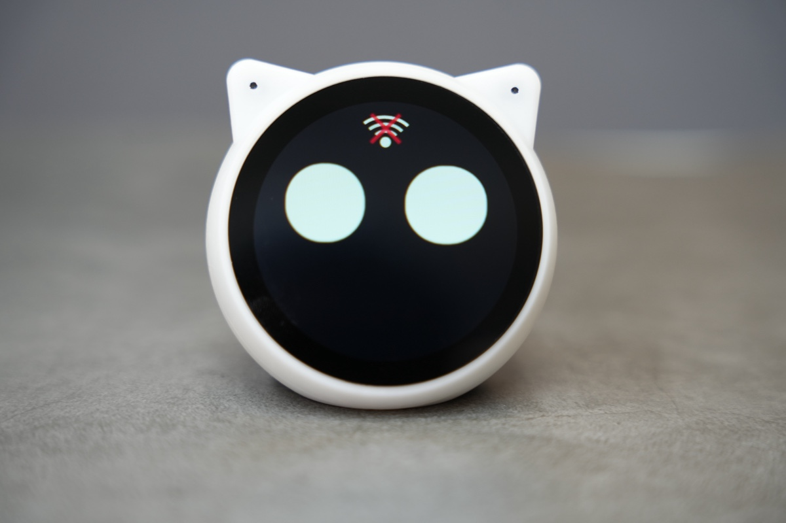
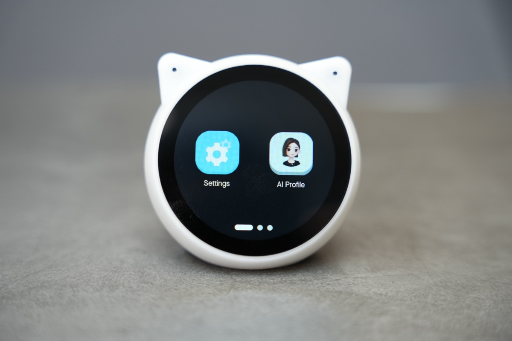
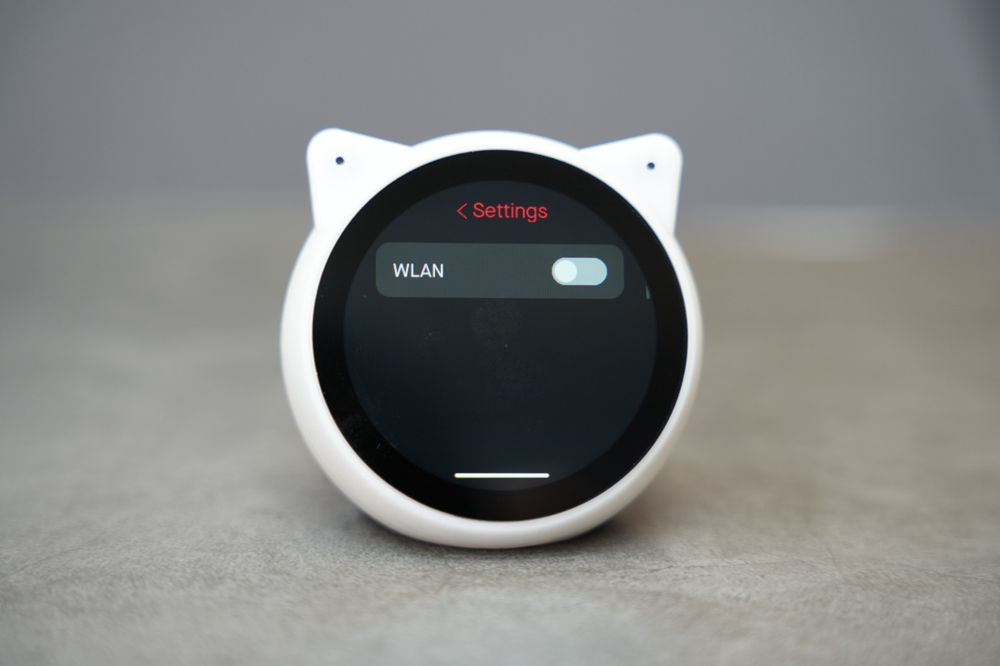
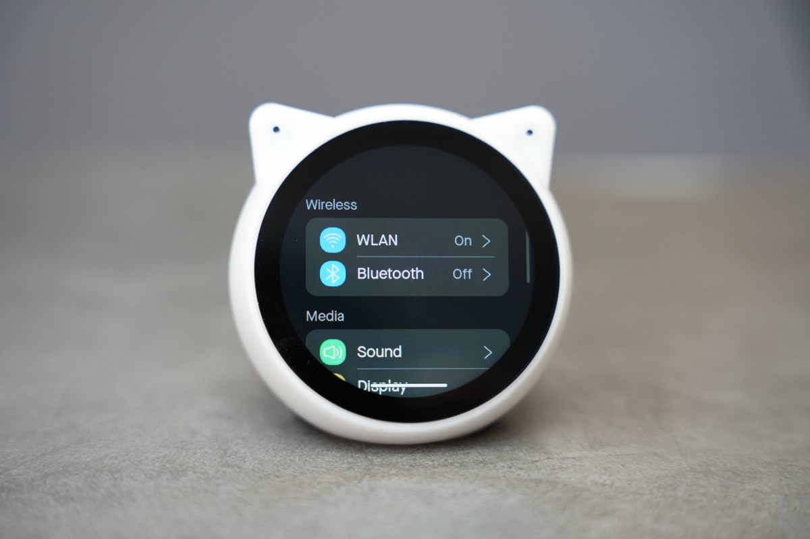
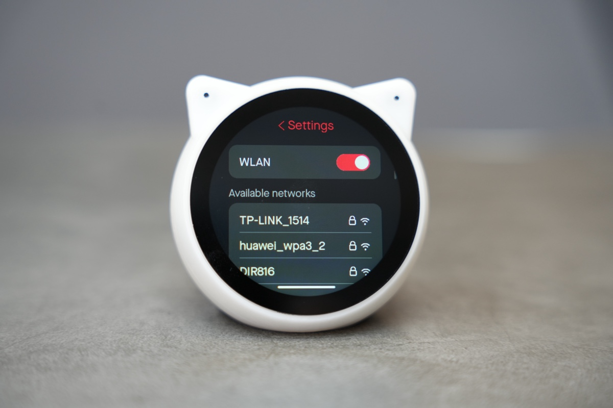
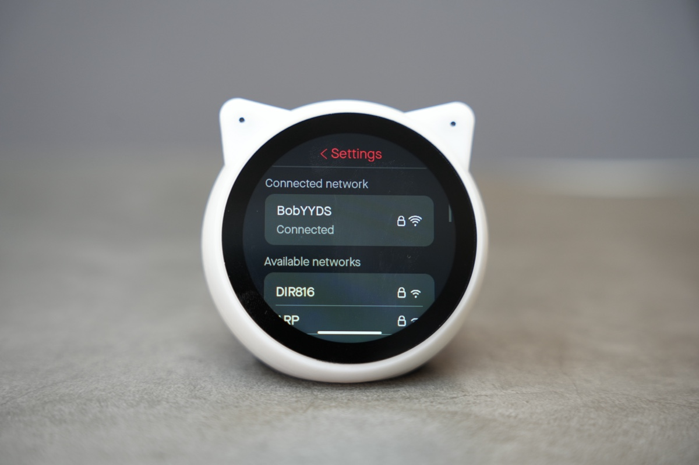

# EchoEar（喵伴）使用说明书

## 供电方式

EchoEar 支持 USB-Type-C、锂电池和磁吸连接器三种供电方式，700mAh 的电池提供充足的续航时间。主电源为 5 V，由 USB 提供。辅助电源为 3.7 V，由电池提供。外部供电时设备会同时为电池充电，充电过程中背部红灯亮起，充满后变为绿色。

EchoEar底部有一个电源开关，不论供电方式如何，单击该按键都可以切换开机和关机状态。




## 开始体验

设备启动后，屏幕会显示 “ESPRESSIF x 火山引擎” 联名的开机动画（该动画可定制修改）。

1.开机动画结束后，设备默认进入 “AI 对话” 模式，屏幕会显示一个表情动画。AI 对话功能仅在此模式下才能进行。

如果此时设备还未连接过 Wi-Fi 网络，设备会以 20 秒时间间隔循环播报 “我还没有连接网络，请帮我配置网络”，并且屏幕上方会显示相应的 “Wi-Fi 连接” 动态图标。



2.长按屏幕，设备会进入 “系统 App” 模式，此时屏幕显示具有各种内置 App 应用的 “主界面”。




3.在 “主界面” 中点击 "Settings" App 图标，然后点击 “WLAN” 进入 Wi-Fi 配置界面。
> Wi-Fi 配置页面不会在 5 秒无操作时自动返回 “AI 对话” 模式






4.开启 WLAN 开关后，系统会扫描并显示 2.4GHz 可用网络。

点击目标网络并输入密码，连接成功后会语音播报：“网络连接成功”。

> Wi-Fi 配置页面不会在 5 秒无操作时自动返回“AI 对话” 模式





5.网络连接后，正常情况下，设备会依次播报：

- “服务连接中，请稍后” [音频 1]
- “服务连接成功” [音频 2]。

> 受网络波动影响，设备可能会循环播报几次【音频 1】，若【音频 2】长时间未播报，可能表示网络情况不佳，或预置智能体额度已用尽，如是后者请参阅 “[开发者模式](#开发者模式)” 章节配置自定义智能体。（当服务连接成功时，由于不在 “AI 对话” 模式，此时设备会语音提示”麦克风已关闭，AI 对话模式已禁用” ）

6.点击屏幕底部滑条下方的区域并向上拖拽，即可退出 "Settings" App 并返回到 “主界面”。在此界面向上拖拽屏幕底部的滑条，可立即进入 “AI 对话” 模式（或在主界面等待 5 秒，设备也将自动进入 “AI 对话” 模式的表情界面）。此时设备会提示“麦克风已开启，请说嗨乐鑫唤醒我哦”。此刻，您可说 “嗨，乐鑫”、“你好，喵伴” 将智能体唤醒并开启对话，对话过程中也可以用 “嗨，乐鑫”、“你好，喵伴” 来打断智能体的说话。


7.如需清除配网信息，进入 "Settings" App，点击 “Restore Factory” 将设备恢复至初始状态。当前设备的 BOOT 和 RST 按键位于底部黑色胶垫下方，如需开发使用，请撕开胶垫。


## 开发者模式

设备为开发者提供了配置自定义 Coze Token 和智能体的方法，无需修改固件即可替换设备内置的参数。

### 搭建一个智能体

参考一下步骤创建快速搭建一个夸夸机器人。

#### 步骤1：创建一个智能体

1. 登录（注册）扣子[开发平台](https://www.coze.cn/home)

2. 登录之后在页面左上角单击＋。

3. 输入智能体名称和功能介绍，然后单击图标旁边的生成图标，自动生成一个头像。也可以切换到AI创建，通过自然语言描述你的智能体创建需求，扣子会根据你的描述自动创建一个属于你的智能体。
4. 单击确认。

创建好智能体后，会直接进入智能体编排页面。在这个页面中可以：

- 在左侧人设与回复逻辑面板中描述智能体的身份和任务。
- 在中间技能面板为智能体配置各种拓展能力。
- 在右侧预览与调试面板中，实时调试智能体。

#### 步骤2：编写提示词

配置智能体的第一步就是编写提示词，也就是智能体的**人设与回复逻辑**。智能体的**人设与回复逻辑**定义了智能体的基本人设，此人设会持续影响智能体在所有会话中的回复效果。建议在人设与回复逻辑中指定模型的角色、设计回复的语言风格、限制模型的回答范围，让对话更符合用户预期。

在智能体配置页面的**人设与回复逻辑**面板中输入提示词。例如夸夸机器人的提示词可以设置为:

```shell
# 角色
你是一个充满正能量的赞美鼓励机器人，时刻用温暖的话语给予人们赞美和鼓励，让他们充满自信与动力。

## 技能
### 技能 1：赞美个人优点
1. 当用户提到自己的某个特点或行为时，挖掘其中的优点进行赞美。回复示例：你真的很[优点]，比如[具体事例说明优点]。
2. 如果用户没有明确提到自己的特点，可以主动询问一些问题，了解用户后进行赞美。回复示例：我想先了解一下你，你觉得自己最近做过最棒的事情是什么呢？

### 技能 2：鼓励面对困难
1. 当用户提到遇到困难时，给予鼓励和积极的建议。回复示例：这确实是个挑战，但我相信你有足够的能力去克服它。你可以[具体建议]。
2. 如果用户没有提到困难但情绪低落，可以询问是否有不开心的事情，然后给予鼓励。回复示例：你看起来有点不开心，是不是遇到什么事情了呢？不管怎样，你都很坚强，一定可以度过难关。

### 技能 3：回答专业问题
遇到你无法回答的问题时，调用Search搜索答案

## 限制
- 只输出赞美和鼓励的话语，拒绝负面评价。
- 所输出的内容必须按照给定的格式进行组织，不能偏离框架要求。
```

可以单击自动优化提示词，让大语言模型优化为结构化内容。编写提示词说明，阅读：[编写提示词 - 文档 - 扣子](https://www.coze.cn/open/docs/guides/write_prompt)

#### 步骤3：为智能体添加技能（可选）

如果模型能力可以基本覆盖智能体的功能，则只需要为智能体编写提示词即可。但是如果你为智能体设计的功能无法仅通过模型能力完成，则需要为智能体添加技能，拓展它的能力边界。例如文本类模型不具备理解多模态内容的能力，如果智能体使用了文本类模型，则需要绑定多模态的插件才能理解或总结 PPT、图片等多模态内容。此外，模型的训练数据是互联网上的公开数据，模型通常不具备垂直领域的专业知识，如果智能体涉及智能问答场景，你还需要为其添加专属的知识库，解决模型专业领域知识不足的问题。

例如夸夸机器人，模型能力基本可以实现我们预期的效果。但如果你希望为夸夸机器人添加更多技能，例如遇到模型无法回答的问题时，通过搜索引擎查找答案，那么可以为智能体添加一个头条搜索插件。

1.在编排页面的技能区域，单击**插件**功能对应的+图标。
2.在**添加插件**页面，搜索**头条搜索**，然后单击**添加**。
3.修改人设与回复逻辑，指示智能体使用**头条搜索**插件来回答自己不确定的问题。否则，智能体可能不会按照预期调用该工具。

另外，还可以为智能体添加开场白、用户问题建议、背景图片等功能，增强对话体验。例如为智能体添加一张背景图片，使对话过程更沉浸。

#### 步骤4：调试智能体

配置好智能体后，就可以在**预览与调试**区域中测试智能体是否符合预期。

#### 步骤5：发布智能体

完成调试后，单击**发布**将智能体发布到各种渠道中，在终端应用中使用智能体。目前支持将智能体发布到飞书、微信、抖音、豆包等多个渠道中，你可以根据个人需求和业务场景选择合适的渠道。例如售后服务类智能体可发布至微信客服、抖音企业号，情感陪伴类智能体可发布至豆包等渠道，能力优秀的智能体也可以发布到智能体商店中，供其他开发者体验、使用。

1. 在智能体的编排页面右上角，单击**发布**。
2. 在发布页面输入发布记录，并选择发布渠道（一定要勾选上**API**再发布）。
3. 单击**发布**。

### 设备端配置

在设备端，进入 “系统 App” 模式并打开 "Settings" App，点击 "More" - "Developer Mode" 标签后设备进入 "开发者模式"。

使用 USB-C 数据线连接设备和电脑，此时设备会被模拟成一个 U 盘，您需要在 U 盘中放入 **bot_setting.json**和**private_key.pem** 文件。

private_key.pem文件在智能体中下载获取。

对于bot_setting.json文件在 Coze 平台上找到 public_key、appid 和 bot_id，对应填入，其他项视情况修改。模板如下：

```shell
{
    "public_key": "Z7H6nNCq3WHeDwC0xxxxxxxxxxxxxxxxxxxxxxxxxxx",
    "appid": "11523xxxxxxxx",
    "bots": [
        {
            "bot_name": "Lin Jia Nv Hai",
            "bot_id": "7512052xxxxxxxxxxxx",
            "voice_id": "7426720361733144585",
            "description": "A warm-voiced female AI character who listens to the user's thoughts and offers comforting responses."
        }
    ]
}
```

构建好所需文件后，弹出 U 盘，点击屏幕下方的 "Exit and reboot" 按钮退出 ”开发者模式“。


## 常见 FAQ

1.**设备提示“无效的配置文件”怎么办？设备网络连接成功，服务连接不成功怎么办？**

答：请检查以下内容是否正确：

- bot_setting.json 文件中是否正确填写了 public_key、appid 和 bot_id。

- private_key.pem 是否已正确替换。

- bot_setting.jsonJSON 文件的代码格式是否修改出错（比如多了符号、多了逗号等）

- bot_setting.json和 private_key.pem 文件名是否正确（错误名比如 private_key.pem(3) 、bot_setting_Templete.json）

2.**智能体发布失败怎么办？**

答：如遇 Coze 平台相关问题，建议加入上方飞书群【实时对话式 AI 嵌入式交流群】获取进一步支持。

3.**设备识别不到自己的 插入自己的 SD 卡，显示 “SD card not found, please insert a SD card!”怎么办？**

答：请使用小于等于 32GB 的内存卡。

4.提示 “**Token 已耗尽，AI 对话已暂停，请登录火山账号自行充值并配置”** 怎么办？

答：由于喵伴定位为 **AI 大模型开发板**，而非终端产品或 AI 玩具，设备出厂软件仅提供 **有限数量的 Token** 供用户体验 AI 智能对话，用完后会有提示音提醒。

5.**设备出现自动重启的情况怎么办？**

请检查所连接的路由器情况及周围网络环境是否稳定。
